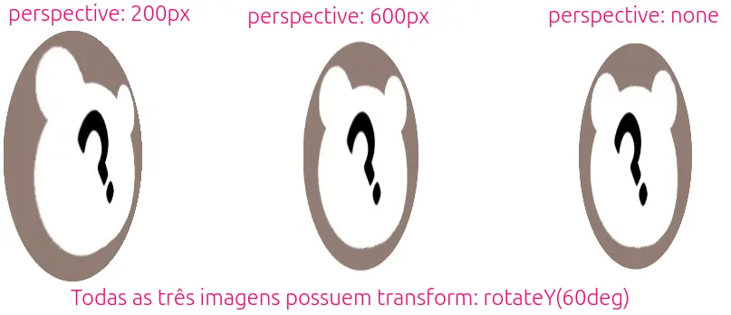

# EduKids Animals

[Baixe o código seminal.][baixar-atividade] Seus pais vão viajar e você deve cuidar do seu mini irmãozinho de 3 anos.

Com um comportamento de anjinho das trevas, o pequeno Joãozinho vai precisar ser
entretido por um bom tempo. Você, como um ótimo irmã(ão) e programador(a)
exímio, decide que é hora de criar um jogo Web para, além de entreter seu
mini-irmão, ensiná-lo como falar o nome de alguns animais.

[baixar-atividade]: https://github.com/fegemo/cefet-front-end-edukids/archive/refs/heads/gh-pages.zip

## Atividade

O jogo funciona assim:

- Assim que apertar **play**, o jogo começa
- A cada ~5s, um animal é sorteado e começa a ficar agitado, com fome
- Você deve clicar no animal agitado para alimentá-lo antes que ele coma
  alguém
  - Fazendo isso, ganha-se 1 ponto
- Se um animal não é clicado, perde-se 2 pontos
- Se um animal que estava sossegado é perturbado fora de hora, perde-se 1
  ponto

Toda essa funcionalidade **já está implementada**. O que está **faltando**:

1. O jogo ainda não dá um _feedback_ visual interessante para o jogador
   - Apenas o nome do animal aparece escrito e seu irmão ainda não sabe ler
1. O arquivo javascript `jogo.js` controla o jogo. Ele tem um temporizador que
   fica **adicionando e removendo classes dos elementos** dos animais
   - `com-fome`, quando o animal está com fome
   - `satisfeito`, quando o animal acabou de comer
   - `foi-incomodado`, quando um animal sossegado é perturbado
   - `atacando`, quando um animal com fome não é alimentado a tempo

### Exercício 1

Crie uma **transição para quando o mouse estiver em cima dos botões**
   _play/stop_ (para que o elemento se revele lentamente). Veja em `exercicio.css` qual propriedade CSS está sendo usada para que os botões
   fiquem escondidos ou visíveis, e crie uma transição. 

### Exercício 2

Você deve implementar uma **metáfora visual** para cada um dos 4 estados dos
animais. Algumas **sugestões** (mas **não se atenha a elas**):

- a) `com-fome`, animal piscando (opacidade variando)
- b) `satisfeito`, uma borda verde no animal e o animal fica girando de alegria
- c) `foi-incomodado`, animal vai crescendo, ou fica pulsando
- d) `atacando`, animal dá um salto e cresce, com uma borda vermelha

O arquivo `exercicio.css`, que é onde você deve trabalhar,
informa quanto tempo um animal fica em cada situação.
Você pode usar essa informação para definir o tempo das
animações em CSS.

### Desafio 1: Mais de uma Animação

Faça uma das situações ter mais de uma animação (veja no [FAQ](#faq)).

### Desafio 2: Efeito 3D

Coloque um efeito tridimensional (de profundidade) em alguma animação
(veja no [FAQ](#faq)).

### Desafio 3: Publicando

Primeiramente, vamos configurar a página para ser compartilhada. Sabe quando
você envia um link pelo WhatsApp e ele mostra uma fotinha/descrição da página
que está sendo compartilhada? Pois é, bora fazer isso.

Comece ao colocar seu nome em alguns lugares da página:
1. No arquivo `index.html`, faça uma busca com substituição 
   (comando <kbd>Ctrl</kbd>+<kbd>h</kbd>) para trocar todas as ocorrências 
   de `Edukids Animals` por `Edukids Agripino` (claro, se seu nome for 
   Agripino... senão, ponha seu nome).
1. Ainda em `index.html`, modifique toda URL que aponta para o repositório 
   do professor para a URL do seu próprio repositório, que você irá publicar:
   - Onde está `https://fegemo.github.io/cefet-front-end-edukids/`, mude para 
     `https://USER-DO-AGRIPINO.github.io/cefet-front-end-edukids/`, onde 
     `USER-DO-AGRIPINO` é o seu usuário no Github.
     - Tem que trocar isso em 4 lugares. 
1. Em `manifest.json`, modifique `Edukids Animals` por `Edukids Agripino` 
   (seu nome).

Depois, vamos tornar a pasta um repositório git e publicá-la. Comece renomeando
a pasta para `cefet-front-end-edukids`. Em seguida, torne-a um repositório git, 
depois publique-o no Github com nome `cefet-front-end-edukids` e ative
o serviço Github Pages para que você possa hospedar a página
publicamente e mostrar pra sua família em:

[https://SEU_USUARIO.github.io/cefet-front-end-edukids](https://SEU_USUARIO.github.io/cefet-front-end-edukids)

Por fim, envie a URL para toda a família =)

## FAQ

1. Qual a diferença entre `transition` e `animation`?
   - Veja no
     [slide sobre `transition` _vs_ `animation`][transition-ou-animation].
1. O que é uma transformação?
   - É uma operação de translação (deslocamento), escala (dimensionamento) ou
     rotação (giro) que pode ser aplicada aos elementos da página. Veja
     sobre [transformações nos slides][transformacoes].
1. Como posso criar uma animação?
   Uma animação é composta por uma sequência de quadros (`@keyframes`) e
   uma propriedade `animation` em um elemento. Veja mais nos
   [slides sobre como criar animações][criando-uma-animacao].
1. Posso fazer mais de uma animação em sequência?
   - Sim! Basta colocar duas animações, separadas por vírgula, como valor
     da propriedade `animation`. Além disso, a segunda animação deve ter um
     `animation-delay` igual à duração da primeira. Veja no
     [slide sobre mais de uma animação][mais-de-uma-animacao].
1. Para ter um efeito 3D, são necessárias duas coisas:
   - A transformação aplicada deve, de alguma forma, 
     alterar a coordenada Z do objeto 
     (eg, rotateX e rotateY).
   - O **_container_ do elemento que sofreu a transformação**
     deve ter um valor de propriedade `perspective` com
     uma distância (normalmente algo entre 400px e 900px). No caso
     desta página, cada `.animal` está dentro de um `.container-animal` (que é quem deve ter a 
     propriedade `perspective`) definida com um valor. Veja a imagem
     a seguir em que o _container_ possui diferentes valores
     para essa propriedade:
     

[criando-uma-animacao]: https://fegemo.github.io/cefet-front-end/classes/css6/#criando-uma-animacao
[transition-ou-animation]: https://fegemo.github.io/cefet-front-end/classes/css6/#animation-ou-transition
[transformacoes]: https://fegemo.github.io/cefet-front-end/classes/css6/#transformacoes
[mais-de-uma-animacao]: https://fegemo.github.io/cefet-front-end/classes/css6/#mais-de-uma-animacao
